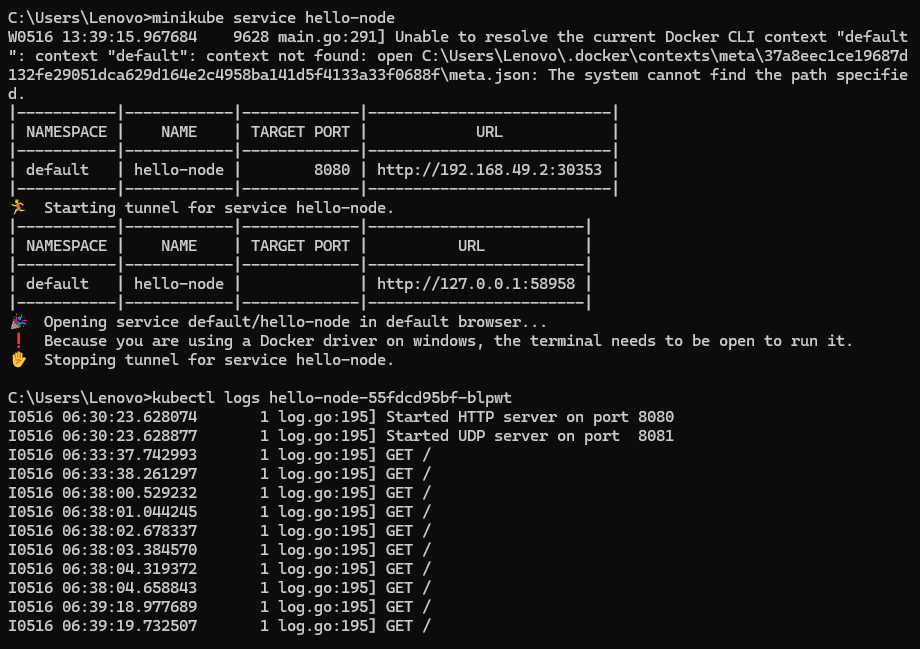

# Tutorial Modul 11
## Reflection on Hello Minikube
### 1. Compare Logs
Compare the application logs before and after you exposed it as a Service. Try to open the app several times while the proxy into the Service is running. What do you see in the logs? Does the number of logs increase each time you open the app?

Sebelum 

Sesudah

Berdasarkan dokumentasi di atas, dapat dilihat bahwa log mengalami penambahan setiap kali kita membuka atau me-refresh aplikasi. Pada gambar diatas terlihat bahwa pada gambar sesudah terdapat tambahan log berupa `GET /` Hal ini terjadi karena pengguna melakukan request GET sehingga logs bertambah.

### 2. Penggunaan `-n`
What is the purpose of the `-n` option and why did the output not list the pods/services that you explicitly created?

Opsi `-n` pada perintah `kubectl get` digunakan untuk menentukan namespace dari mana kita ingin melihat resource. Ketika Anda menjalankan `kubectl get` tanpa opsi `-n`, perintah ini hanya akan menampilkan resource di namespace default di mana Anda bekerja saat ini. Sebaliknya, menggunakan `kubectl get -n` diikuti dengan nama namespace, seperti `kube-system`, akan memfilter perintah untuk hanya menampilkan resource di dalam namespace yang ditentukan.

Tujuan utama dari opsi `-n` adalah untuk memungkinkan Anda melihat pods dan services di namespace tertentu. Jika Anda tidak menggunakan opsi `-n kube-system`, outputnya hanya akan mencakup resource dari namespace default. Akibatnya, pods dan services yang telah Anda buat secara eksplisit di namespace `kube-system` tidak akan ditampilkan karena perintah tanpa opsi `-n` tidak mencakup resource di luar namespace default.

Sebagai kesimpulan, opsi `-n` sangat penting untuk mengakses resource di namespace tertentu, memastikan bahwa Anda dapat melihat dan mengelola pods dan services yang spesifik untuk namespace tersebut, seperti yang ada di `kube-system`, yang sebaliknya akan diabaikan dari tampilan default.